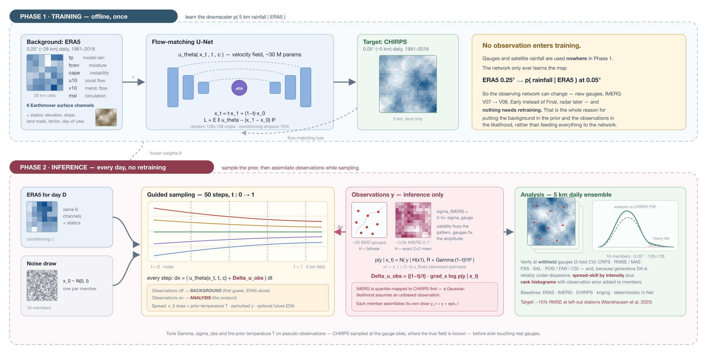

# BDhighresDA

**Generative downscaling + data assimilation for daily rainfall over Bangladesh.**

ERA5 (0.25°) is downscaled to **0.05° (~5 km) daily precipitation** by a
conditional **flow-matching** generative prior, then corrected at inference
time by **GPM IMERG footprints and sparse BMD rain gauges**, both assimilated
through score guidance — no retraining needed when the observing network
changes.

**Two phases, and only one sees observations.**
*Training* (offline, once): ERA5 → U-Net → CHIRPS at 5 km. No gauge, no
satellite. The network learns `p(rainfall | ERA5)` and nothing else.
*Inference* (every day): the same frozen network samples a background from
ERA5, and observations nudge every integration step to give the analysis.
That separation is what makes this data assimilation rather than multi-input
regression, and it means the observing network can change — new gauges, a new
IMERG version, radar later — without retraining anything.

The approach follows [Manshausen et al. (2025, *JAMES*)](https://doi.org/10.1029/2024MS004505)
(score-based data assimilation of weather stations at km scale), with the
diffusion prior replaced by a rectified-flow model
([Lipman et al. 2023](https://arxiv.org/abs/2210.02747);
[Wetherell 2026](https://arxiv.org/abs/2606.00281)).

📖 **Read [`docs/METHODOLOGY.md`](docs/METHODOLOGY.md) first** — it contains
the full scientific design, the math linking flow matching to SDA guidance,
the data plan, and the experiment/ablation list.

---

## Pipeline at a glance



| Step | Script |
|---|---|
| 0. ERA5 predictors | `scripts/00_download_era5.py` |
| 1. CHIRPS target | `scripts/01_download_chirps.py` |
| 2. IMERG observations | `scripts/02_download_imerg.py` |
| 3. DEM + static fields (orography, mask, position) | `scripts/03_download_dem.py`, `scripts/03_build_static.py` |
| 4. Regrid + pack to Zarr, then alignment QC | `scripts/04_regrid_and_pack.py`, `scripts/04_check_alignment.py` |
| 5. Station QC + pseudo-stations | `scripts/05_prepare_stations.py` |
| 6. Normalisation stats | `scripts/06_compute_stats.py` |
| 7. IMERG bias correction | `scripts/07_bias_correct_imerg.py` |
| 8. Train the prior | `scripts/train.py` |
| 9. Assimilate → product | `scripts/assimilate.py` |
| 10. Verify | `scripts/evaluate.py` |
| — | `scripts/make_pipeline_figure.py` regenerates the pipeline figure |

## Quick start

```bash
# 0. portable/local environment (PRISM users: use the GH200 section below)
conda env create -f environment.yml && conda activate bdhires
pip install -e .

# 1. does everything work? (synthetic data, CPU, ~2 min, no downloads)
python scripts/smoke_test.py

# 2. data
# ERA5 extraction needs the dedicated Python 3.12 Icechunk environment.
# On Prism, this launches setup on an ARM CPU node:
slurm/setup_earthmover_env.sh
# On an ARM/local machine with a working Conda installation, the equivalent is:
# conda env create -p ../envs/bdda-earthmover -f environment-earthmover.yml
conda run -p ../envs/bdda-earthmover \
  python scripts/00_download_era5.py --start 1981 --end 2025 --out data/raw/era5
python scripts/01_download_chirps.py --start 1981 --end 2025 --out data/raw/chirps
python scripts/03_download_dem.py --out data/raw/dem/copernicus_glo90_wide.nc
python scripts/03_build_static.py --dem data/raw/dem/copernicus_glo90_wide.nc \
       --chirps data/raw/chirps/chirps_wide_2010.nc --out data/static/static_wide.nc
python scripts/04_regrid_and_pack.py --start 1981 --end 2025 --out data/processed/bd_wide.zarr
python scripts/04_check_alignment.py --zarr data/processed/bd_wide.zarr \
       --out data/processed/alignment_qc.json
python scripts/06_compute_stats.py --zarr data/processed/bd_wide.zarr \
       --train-years 1981 2018 --transform log1p --out data/processed/stats.json

# On Prism, submit resumable CHIRPS downloads to CPU-only nodes:
slurm/submit_download_chirps.sh

# ERA5: free Earthmover ARCO store, six variables, daily regional files:
slurm/submit_download_era5.sh

# DEM: public Copernicus GLO-90, then build all seven static channels:
slurm/submit_dem_static.sh

# ERA5 + CHIRPS + static training store, followed by lag-alignment QC:
slurm/submit_pack_training_data.sh

# Training-period normalization statistics (requires alignment pass):
slurm/submit_compute_stats.sh

# Real-data, production-batch GH200 preflight (no checkpoint is saved):
slurm/submit_preflight_training_gh200.sh

# 3. after PREFLIGHT PASSED, train on PRISM GH200:
slurm/submit_train_gh200.sh               # single stage, ERA5-conditioned prior

# 4. tune the DA hyperparameters on pseudo-observations, THEN on real gauges
python scripts/evaluate.py --config configs/da.yaml --ckpt runs/prior_h100/final.pt \
       --start 2019-01-01 --end 2020-12-31 --tune --out results/tuning.json

# 5. produce the product
slurm/submit_assimilate_gh200.sh          # array job, one year per task

# 6. verify against withheld gauges (3-fold CV) + baselines
python scripts/evaluate.py --config configs/da.yaml --ckpt runs/prior_h100/final.pt \
       --start 2021-01-01 --end 2023-12-31 --cv-folds 3 --out results/cv.json
```

## What you need to supply

| | |
|---|---|
| **ERA5 access** | No key required; the Earthmover AWS Open Data store is read anonymously |
| **Earthdata login** | `~/.netrc` entry for IMERG (GES DISC) |
| **BMD gauge CSV** | `data/stations/bmd_daily_raw.csv`, columns `station_id,name,lat,lon,date,precip_mm` |
| **DEM access** | No key required; Copernicus GLO-90 is downloaded anonymously from the AWS Open Data Registry |

## Conditioning: six ERA5 surface channels

`tp` (model rainfall) · `tcwv` (column moisture) · `cape` (instability) ·
`u10`/`v10` (low-level flow) · `msl` (synoptic circulation), plus the static
fields. These are all available in Earthmover's free surface store.

The regional fields of `u10`, `v10` and `msl` replace the unavailable
vertically integrated moisture-flux pair. ERA5 `tp` remains the strongest
background predictor because it already reflects the model's full dynamics
and moisture convergence. Exact IVT is retained as a future ablation: add it
only if a controlled validation experiment improves CRPS and extreme-rain
skill.

## Domains

| Grid | Extent | Size | Use |
|---|---|---|---|
| `wide` | 84.0–96.8°E, 16.0–28.8°N | 256×256 @ 0.05° | training (random 128×128 crops) |
| `bd` | 87.6–94.0°E, 20.3–26.7°N | 128×128 @ 0.05° | evaluation and the released product |

The wide domain exists because ~16,000 daily fields is a small dataset for a
generative model; random cropping multiplies the effective sample count and
exposes the model to a wider range of rainfall regimes. See §5 of the
methodology.

## Compute notes

* **PRISM GH200 (`aarch64`)**: `configs/train_h100.yaml`, one GPU, bf16,
  batch 32. Use the ARM-native `bdda-gh200` environment and the submission
  wrappers described below.
* **2 × V100 (32 GB, x86-64 alternative)**: `configs/train_v100.yaml`, batch
  8/GPU. V100 is `sm_70` and has **no bf16 tensor cores**, so
  `utils/dist.amp_dtype()` automatically selects fp16 + `GradScaler`. Never
  use the GH200 ARM environment for this workflow.
* Guided sampling backpropagates through the network, so a 16-member guided
  day costs ~2–3× an unguided one — budget ~10–30 s/day on one GPU. That cost
  is independent of observation count, so the ~3,500 IMERG footprints are
  effectively free alongside the 35 gauges.

## NASA NCCS PRISM GH200

PRISM Grace nodes are `aarch64` systems with one GH200 GPU per node. Use the
existing ARM Miniforge environment:

```bash
source /home/afahad/nb/project/BDDA/miniforge3-aarch64/etc/profile.d/conda.sh
conda activate /home/afahad/nb/project/BDDA/envs/bdda-gh200
export PYTHONNOUSERSITE=1

cd /path/to/BDhighresDA
python -m pip install -e . --no-deps

mkdir -p logs
sbatch slurm/train_h100.sbatch
```

`--no-deps` is intentional: the ARM environment already contains compatible
package versions. Batch jobs must not install or update packages. The
recommended submission commands create `logs` automatically:

```bash
slurm/submit_train_gh200.sh
slurm/submit_assimilate_gh200.sh
```

Monitor or cancel jobs with:

```bash
squeue -u "$USER"
scontrol show job JOB_ID
tail -f logs/bdhires-gh200-JOB_ID.out
scancel JOB_ID
```

See [`COMPUTE.md`](COMPUTE.md) for environment isolation, automatic checkpoint
resumption, array concurrency, log names, preflight checks, and the retained
x86-64 V100 alternative.

## Ensemble spread

Generative DA systems are reliably under-dispersive; this one is built to
fight that, with three independent spread sources:

1. **Prior temperature `T`** — sampling `p^(1/T)` adds exactly one term,
   `u_T = u_θ + (1 − 1/T)·x̂₀/t`, and widens the ensemble monotonically
   (asserted in the smoke test). Inflating the *prior* means observations pull
   members back where they exist, so spread grows only where the field is
   unconstrained.
2. **Optional future ERA5-EDA members** — real background uncertainty, one
   member each. These are not included in the Earthmover surface workflow and
   would require a separate CDS download.
3. **Perturbed observations** — `y_r = y + ε_r`, spatially correlated for
   IMERG. Assimilating identical `y` into every member is the generative
   analogue of an unperturbed-obs EnKF.

Note that SDE sampling (`noise_scale`) is *not* a spread knob — it has
matching marginals by construction. See §6 of the methodology, which is the
part worth reading twice.

## Repository layout

```
src/bdhires/
  grids.py          domain definitions (lat ASCENDING everywhere)
  transforms.py     precipitation transforms (log1p / sqrt / cbrt)
  models/unet.py    ADM-style U-Net velocity network
  models/flow.py    rectified flow: interpolant, loss, score<->velocity identities, EMA
  da/observation.py station + IMERG operators, R, perturbed obs, k-fold splits
  da/guidance.py    Gaussian obs likelihood + guidance gradient (SDA Eq. 3)
  da/sampler.py     ODE/SDE sampler with guidance + Langevin correctors
  data/             Zarr dataset with random-crop augmentation; BMD station I/O
  eval/metrics.py   RMSE/MAE/CRPS, FSS, SAL, POD/FAR/CSI/ETS
  eval/calibration.py spread-skill (overall + by intensity), rank hist, inflation
configs/            data + model + training + DA hyperparameters
scripts/            numbered data pipeline, then train / assimilate / evaluate
slurm/              ready-to-submit batch scripts
```

## Status

Scaffold complete and smoke-tested; no real data has been ingested yet.
Open items are tracked in [`docs/ROADMAP.md`](docs/ROADMAP.md).

## License

MIT (code). Note that CHIRPS, ERA5 and IMERG each carry their own
attribution requirements, and BMD gauge data is not redistributable without
BMD's permission — `data/` is gitignored.
