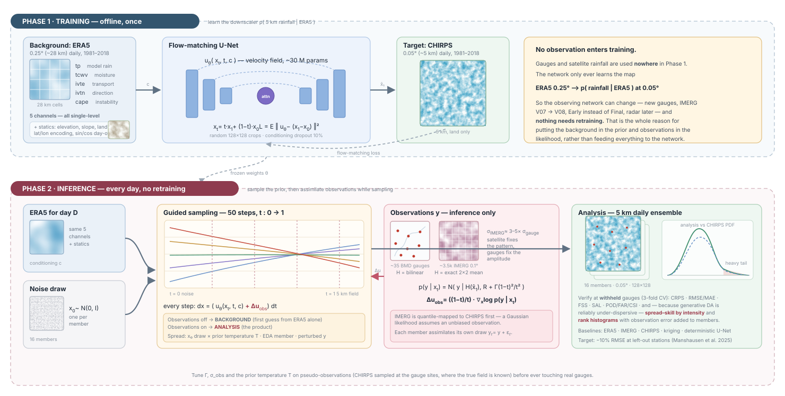

# BDhighresDA — Methodology

A 5 km daily precipitation reanalysis for Bangladesh built by **generative
downscaling of ERA5 + IMERG**, then **corrected by sparse BMD gauge
observations at inference time** using score/flow guidance.

The design follows Manshausen et al. (2025, *JAMES*) — an unconditional
diffusion prior over km-scale fields, with weather stations assimilated
zero-shot at sampling time — but replaces the diffusion prior with a
**conditional rectified-flow (flow-matching) model**, which recent work finds
gives better spatial skill at ~1/3 the sampling cost (Wetherell 2026).

---

## 0. Pipeline overview



**Read it left to right.** (1) ERA5, static fields and the calendar form the
conditioning `c`; IMERG is switchable between conditioning and observation.
(2) A U-Net regresses the flow-matching velocity field `u_theta(x_t, t, c)`,
trained (3) against CHIRPS 0.05 deg as the target `x1` along the linear
interpolant. (4) At inference the ODE is integrated with Heun's method while
the gauge/IMERG likelihood nudges every step, which is the assimilation.
(5) The output is a 16-member 5 km daily ensemble, verified at withheld gauges.

The one thing to notice: the network is trained *only* on CHIRPS. It never
sees an observation. Everything in panel 4 happens at sampling time, which is
why new observations never require retraining.

---

## 1. The problem

| | |
|---|---|
| Background | ERA5, 0.25° (~28 km), 1940–present, hourly → daily |
| Stage-1 observation | GPM IMERG Final, 0.1° (~10 km), 2000-06 → present, daily |
| Target resolution | 0.05° (~5 km), daily |
| Truth for training | CHIRPS v2.0 daily 0.05°, 1981–present |
| Stage-2 observation | BMD daily rain gauges, ~35 stations, 2020–2025 |
| Target variable | daily total precipitation (mm/day) |

ERA5 at 28 km cannot resolve the two features that dominate Bangladesh
rainfall: the Meghalaya/Shillong orographic barrier (which produces the
world's highest annual totals ~40 km north of the border) and the mesoscale
organisation of monsoon convection. IMERG sees *where* it rained but has
known gauge-relative biases; the gauges are accurate but sparse (one per
~4,200 km²). The generative model supplies the missing spatial structure, and
the gauges pin down the amplitude.

## 2. Why generative, and why this particular decomposition

A deterministic downscaler (U-Net, CNN) trained on MSE produces the
*conditional mean*, which for precipitation is over-smooth and systematically
under-represents extremes — exactly the values a flood-risk study needs.
A generative model samples from `p(x_hires | ERA5, IMERG)`, so it produces
sharp, physically plausible fields and an ensemble that quantifies the
genuine ambiguity in the 28 km → 5 km map.

Assimilation then targets the posterior

```
p(x | y_stations, ERA5, IMERG)  ∝  p(x | ERA5, IMERG) · p(y_stations | x)
```

The generative prior handles the first factor; the second is a simple
Gaussian likelihood evaluated through a differentiable interpolation
operator. Crucially, **the network is never trained on station data**, so
you can add gauges, change the network, or assimilate a completely different
observation type (radar, satellite soil moisture) without retraining. This
"zero-shot DA" property is the central claim of the Manshausen paper and the
main reason to prefer it over an end-to-end trained observation-fusion model
(e.g. MetNet-style), which must be retrained whenever the observing network
changes — a serious problem for a country whose gauge network has grown and
shifted over four decades.

## 3. The generative model

### 3.1 Rectified flow / stochastic interpolant

```
x_t = t·x₁ + (1−t)·x₀ ,   x₀ ~ N(0, I),   x₁ ~ p_data
```

The network `u_θ(x_t, t, c)` regresses the conditional velocity `x₁ − x₀`
(Lipman et al. 2023; Albergo et al. 2025). Sampling integrates
`dx/dt = u_θ` from t=0 to t=1 with Heun's method, 50 steps (100 NFE).

Conditioning `c` is channel-concatenated: ERA5 predictors, IMERG, static
fields, seasonal encoding.

### 3.2 Conditioning dropout gives two models for the price of one

10% of training samples have `c` zeroed. At inference the same weights are
therefore usable as:

* a **conditional downscaler** (pass `c`) → the background/first guess, and
* an **unconditional prior** `p(x₁)` (pass `c = None`) → the exact object
  Manshausen et al. train separately, letting you run pure SDA as an ablation
  that isolates how much ERA5 and IMERG actually contribute.

### 3.3 From velocity to score, and back

For this interpolant, with `x̂₁ = x_t + (1−t)u` and `x̂₀ = x_t − t·u`:

```
score(x_t) = ∇ₓ log p_t(x_t) = −x̂₀ / (1 − t)                       (A)
u(x_t)     = ( x_t + (1 − t)·score ) / t                            (B)
```

so an additive perturbation to the score maps to an additive perturbation to
the velocity:

```
Δu = ((1 − t) / t) · Δscore                                          (C)
```

Equation (C) is what lets the SDA guidance machinery drop straight into a
flow-matching sampler. It is implemented in `src/bdhires/models/flow.py`
and unit-tested in `scripts/smoke_test.py`.

### 3.4 Observation guidance

Following Rozet & Louppe (2024) Eq. (3) / Manshausen et al. Eq. (3):

```
p(y | x_t) = N( y | H(x̂₁),  R + (σ_t²/μ_t²)·Γ )
```

with `μ_t = t`, `σ_t = 1−t` for our interpolant, so the inflation term is
`Γ(1−t)²/t²` — observations are heavily down-weighted early in the trajectory
(when the state is mostly noise) and approach their true error variance as
`t → 1`. `Γ` is a scalar hyperparameter; Manshausen et al. found `1e-3`
better than the `1e-2` of the original SDA paper, *specifically for the
precipitation channel*. Start there and re-tune (see §7).

The gradient `∇_{x_t} log p(y|x_t)` is taken **through the network**
(diffusion posterior sampling), so a guided sample costs ~2–3× an unguided
one. Langevin corrector steps (C=2, τ̃=0.3) run at each noise level to stop
guidance errors accumulating, exactly as in SDA Algorithm 4.

This is the direct analogue of the 3D-Var cost function

```
J = (x_b − x)ᵀB⁻¹(x_b − x) + (y − H(x))ᵀR⁻¹(y − H(x))
```

with the learned prior replacing the `B`-weighted background term — except
that the prior here is a full non-Gaussian distribution rather than a
Gaussian with a hand-tuned covariance, which is precisely why it can produce
sharp, non-Gaussian rainfall structure that 3D-Var/OI cannot.

### 3.5 Observation operator

`H` is bilinear interpolation from the 0.05° grid to gauge coordinates,
implemented with `grid_sample` so it is differentiable
(`src/bdhires/da/observation.py`). It acts in **transformed** space, so
station values are passed through the same `log1p` transform as the target.

`R` has two contributions: gauge measurement error (small, ~5%) and
**representativeness error** — the mismatch between a point gauge and a 5 km
cell average. For daily convective rainfall in the monsoon, the second term
dominates and is the one worth tuning carefully. Under-specifying it makes
the analysis chase individual gauges and produce bullseyes; over-specifying
it makes the gauges do nothing.

### 3.6 Where does IMERG belong: prior or likelihood?

IMERG can enter the system in two places, and the repo supports both via
`observations.imerg.mode` in `configs/da.yaml`.

**(A) `condition`** — IMERG is a conditioning channel. Prior is
`p(x | ERA5, IMERG)`; the likelihood contains only gauges.

**(B) `assimilate`** — IMERG is an observation. Prior is `p(x | ERA5)`; the
likelihood contains IMERG footprints *and* gauges, assimilated jointly.

Option B is the more interesting design and is the current default, for four
reasons.

1. **It makes the cascade honest.** ERA5 is a *dynamical background* — it
   tells you the moisture flux, the shear, where the monsoon depression is.
   IMERG is an *observation of rainfall*. Putting the background in the prior
   and observations in the likelihood is the standard DA decomposition, and it
   means the relative weight of satellite vs gauge is an explicit, tunable,
   reportable number (`sigma_obs` per stream) rather than something the
   network learned implicitly and you cannot inspect.
2. **It buys 20 extra years of training data.** IMERG starts 2000-06. An
   ERA5-only prior can be trained on the full 1981–2018 record in one stage —
   ~13,900 days instead of ~6,600, with no two-stage warm-start hack. Given
   that the small dataset is the biggest risk in this project (§5), roughly
   doubling it is worth a lot. It also means you can produce a **1981–2025**
   reanalysis with the same machinery, assimilating IMERG only for the years
   it exists. Option A caps you at 2000-onwards or forces channel masking.
3. **Version- and latency-agnosticism, for free.** Swap IMERG V07 → V08, or
   Final (3.5-month latency) → Early (4-hour latency) with a larger `R`, and
   nothing needs retraining. Same for adding future streams: BMD radar,
   CMORPH, a densified gauge network. That zero-shot property is the whole
   argument for SDA over an end-to-end fusion model, and option A throws it
   away for the one data source most likely to change.
4. **It costs nothing.** The guidance gradient is a single backward pass
   through the network regardless of how many observations there are, so
   adding ~3,500 valid IMERG footprints on top of 35 gauges is essentially
   free. `H` is an exact 2×2 block mean, because both our grids have edges on
   multiples of 0.1° so the 0.05° cells nest perfectly inside IMERG
   footprints — no interpolation error in the forward operator.

**What you give up, and how to handle it.** The Gaussian likelihood assumes
the observation is *unbiased*. IMERG is not: over South Asia it over-detects
light rain, and it systematically underestimates orographic rainfall along the
Meghalaya barrier because passive-microwave retrievals miss shallow warm-rain
processes over land. A conditional network (option A) can learn to correct
that; a likelihood cannot — it will faithfully pull the analysis toward the
biased value. So option B **requires** an offline de-biasing step:
`scripts/07_bias_correct_imerg.py` fits a per-cell, per-season quantile map
from IMERG to CHIRPS with wet-day frequency adaptation, and can fit the
residual error sd by intensity band so `sigma_obs` is measured rather than
guessed. Skipping this step is the main way option B goes wrong.

Two further cautions:

* **Do not double-count.** If IMERG is assimilated, train with
  `configs/train_era5only.yaml`, which zeroes the IMERG conditioning channel.
  Leaving IMERG in *both* the prior and the likelihood makes the analysis
  over-confident and collapses the ensemble.
* **Watch ensemble spread.** ~3,500 dense observations with a small `R` will
  pin the field almost everywhere and drive the ensemble toward a
  deterministic downscaling of IMERG. The intended division of labour is
  *IMERG constrains the pattern, gauges constrain the amplitude*, which in
  practice means `sigma_imerg` ≈ 3–5× `sigma_gauge`. Verify with the
  spread/skill ratio, not by eye.

**Recommendation: run it as a three-way ablation** — `condition`,
`assimilate`, and both-off (gauges only) — on the same withheld stations. The
comparison is a genuine result in itself, since nobody has published on where
satellite precipitation should sit in a generative DA system, and the answer
plausibly differs by season (IMERG is far more informative in JJAS than in
the dry season).


## 4. Precipitation transform (a real decision, not a detail)

Daily rainfall has an atom at zero and a heavy tail. Both reference papers
hit tail problems from opposite directions:

* Manshausen et al. used log/exp and got *occasional unphysical extremes* on
  inversion (their Appendix C).
* Wetherell (2026) used sqrt and got a *dry bias in the far tail*.

`src/bdhires/transforms.py` implements `log1p`, `sqrt`, `cbrt` and `none`
behind one interface. **Default: `log1p` with ε = 0.1 mm** (roughly the BMD
reporting resolution), followed by standardisation on training-period stats.
Treat the transform as a first-class ablation — run at least `log1p` vs
`sqrt` and compare the upper tail of the PDF and FSS at the 100 mm/day
threshold.

## 5. Data volume: how many years do you actually need?

| Stage | Period | Days | Conditioning |
|---|---|---|---|
| A — pretrain | 1981-01 → 2000-12 | ~7,300 | ERA5 only (IMERG channel zeroed) |
| B — main train | 2001-01 → 2018-12 | ~6,600 | ERA5 + IMERG |
| Validation | 2019 → 2020 | ~730 | ERA5 + IMERG |
| Test / product | 2021 → 2025 | ~1,800 | ERA5 + IMERG, gauges assimilated |

**Total: ~16,000 daily fields.** This is the biggest risk in the project.
Manshausen et al. trained on 2.5M images (hourly, large domain). Three
mitigations, all implemented:

1. **Train on random 128×128 crops of a 256×256 "wide" domain**
   (84–96.8°E, 16–28.8°N). This multiplies the effective sample count by
   ~10⁴ distinct crop positions while exposing the model to a wider range of
   rainfall regimes (Bay of Bengal, Meghalaya, Arakan, Gangetic plain).
   Absolute position is fed in through static sin/cos channels so
   location-specific climatology is still learnable.
2. **Two-stage training.** Stage A uses the extra 20 pre-IMERG years with the
   IMERG channel masked; conditioning dropout makes this a coherent thing to
   do rather than a hack. Stage B fine-tunes with IMERG.
3. **Strong EMA (0.999) + dropout 0.1 + cosine LR.** With ~16k samples,
   overfitting shows up as memorised fields; monitor validation flow-matching
   loss, and check unconditional samples against the CHIRPS climatology
   (the "climate of the model" diagnostic of Manshausen Appendix C).

If skill is still limited, the next lever is **more domain, not more years**:
extend the wide grid over all of South Asia and train a single model, then
evaluate over Bangladesh.

## 6. Inputs and outputs, precisely

**Input (conditioning), all on the 0.05° grid, ~30 channels:**

- ERA5 surface: `tp` (conservative-regridded), `tcwv`, `t2m`, `d2m`, `msl`,
  `cape`, `u10`, `v10`, `sp`, vertically-integrated eastward/northward
  moisture flux
- ERA5 pressure levels (850/700/500/200 hPa): `u`, `v`, `q`, `t`, `w`, `z`
- Derived: 850–200 hPa shear magnitude
- IMERG Final daily precipitation (0.1° → 0.05°, conservative)
- Static: sqrt-elevation, slope magnitude, land–sea mask, 4 positional
  encoding channels
- Seasonal: sin/cos of day-of-year

**Output:** `p(precip | ·)` on 128×128 @ 0.05°, sampled as a 16-member
ensemble per day, saved as NetCDF with `precip(time, member, lat, lon)` and
`precip_mean`.

**Time alignment** — the most common silent bug in this kind of study:
CHIRPS day D is 00–24 UTC. ERA5 `tp` is a *backward* hourly accumulation, so
day D = sum of steps 01:00(D)…00:00(D+1); the packing script shifts by −1 h
before resampling. IMERG `3IMERGDF` is already 00–24 UTC but stores a **rate
in mm/hr**, so it is multiplied by 24.

## 7. Experiment plan

1. **Pseudo-observation experiments first.** Sample CHIRPS at the 35 BMD
   coordinates for the whole record and assimilate those. Because the true
   full field is known, this validates the entire DA machinery and lets you
   tune `Γ` and `σ_obs` cleanly (Manshausen §4.1). Sweep station density
   (5 / 10 / 20 / 35 / 100 stations) to quantify how much a denser network
   would buy — a directly policy-relevant result for BMD.
2. **Real gauges, 3-fold cross-validation.** Rotate the withheld third of the
   network; report RMSE, MAE, CRPS, spread–skill ratio and rank histograms at
   left-out stations. Manshausen et al.'s headline was **10% lower RMSE at
   left-out stations** from assimilating 40 stations — that is the number to
   beat.
3. **Ablations**: (a) `prior_sda` = unconditional prior + gauges only (what do
   ERA5/IMERG add?); (b) no-IMERG conditioning (what does IMERG add?);
   (c) deterministic U-Net baseline; (d) `log1p` vs `sqrt` transform;
   (e) Γ ∈ {1e-4, 1e-3, 1e-2}; (f) ensemble size 1 vs 16 vs 64.
4. **Baselines** at the same withheld stations: raw ERA5 bilinear, IMERG,
   CHIRPS itself, quantile-mapped ERA5, and ordinary kriging of the gauges.
   CHIRPS is a *strong* baseline over Bangladesh because it already blends
   gauges — beating it at withheld stations is the real bar, and the honest
   framing is that this method adds (i) daily ensemble uncertainty, (ii)
   ERA5/IMERG dynamical information CHIRPS ignores, and (iii) the ability to
   assimilate gauges CHIRPS never saw.
5. **Verification**: point scores at stations; FSS at 1/10/20/50/100 mm/day
   across 5–165 km neighbourhoods; SAL; categorical POD/FAR/CSI/ETS; PDF and
   tail comparison; monsoon-onset composites; spatial bias maps.

### Known failure modes to check for explicitly

* **Under-dispersion.** Manshausen et al. found their ensembles too narrow.
  Always report spread/skill ratio and rank histograms; if under-dispersive,
  raise `Γ`, add sampler churn, or use ensemble inflation.
* **Assimilation bullseyes.** Their Figure C1 shows precipitation increments
  concentrated *only* at assimilated stations, because the prior was too dry
  and guidance only ever nudged upward. Watch the time-mean increment map.
* **Ocean leakage.** CHIRPS is land-only. The valid mask is applied in the
  loss, the sampler and the output — do not remove it.

## 8. Roadmap beyond precipitation

The architecture is multivariate-ready: add `t2m`, `tmax`, `tmin` as extra
output channels and the same DA machinery assimilates temperature gauges
without any change (Mishra South Asia 5 km gives temperature at the same
0.05° grid and is the natural target). Multivariate training also buys
physical consistency — Manshausen et al. showed their model learned wind–rain
relationships and could infer *unobserved* channels from observed ones.
Longer term: sub-daily via IMERG half-hourly, and a temporal (4D) version
where the prior is over sequences rather than snapshots.

---

## References

- Manshausen, P., et al. (2025). Generative data assimilation of sparse weather
  station observations at kilometer scales. *JAMES*, 17, e2024MS004505.
  <https://doi.org/10.1029/2024MS004505> · <https://arxiv.org/abs/2406.16947>
- Rozet, S., & Louppe, G. (2024). Score-based data assimilation.
  <https://arxiv.org/abs/2306.10574>
- Lipman, Y., et al. (2023). Flow matching for generative modeling.
  <https://arxiv.org/abs/2210.02747>
- Albergo, M. S., Boffi, N. M., & Vanden-Eijnden, E. (2025). Stochastic
  interpolants: a unifying framework for flows and diffusions.
  <https://arxiv.org/abs/2303.08797>
- Wetherell, T. (2026). Flow matching for convective-scale precipitation
  downscaling. <https://arxiv.org/abs/2606.00281>
- Mardani, M., et al. (2024). Residual corrective diffusion modeling for
  km-scale atmospheric downscaling (CorrDiff).
  <https://arxiv.org/abs/2309.15214>
- Fotiadis, S., et al. (2024). Stochastic flow matching for resolving
  small-scale physics. <https://arxiv.org/abs/2410.19814>
- Chen, Y., Jia, et al. (2025). FlowDAS: a stochastic interpolant-based
  framework for data assimilation. NeurIPS 2025.
  <https://arxiv.org/abs/2501.16642>
- Yi, et al. (2026). Efficient kilometer-scale precipitation downscaling with
  conditional wavelet diffusion. *JGR: Machine Learning and Computation*.
  <https://arxiv.org/abs/2507.01354>
- Karras, T., et al. (2022). Elucidating the design space of diffusion-based
  generative models (EDM). <https://arxiv.org/abs/2206.00364>
- Funk, C., et al. (2015). The climate hazards infrared precipitation with
  stations (CHIRPS). *Scientific Data*, 2, 150066.
- Huffman, G. J., et al. (2023). GPM IMERG Final Precipitation L3 1 day V07.
